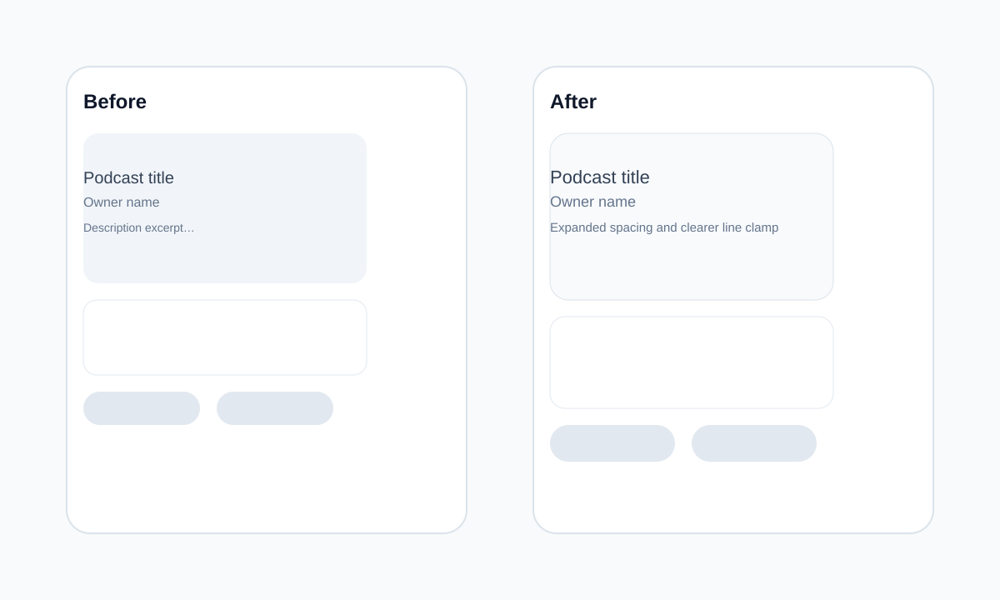
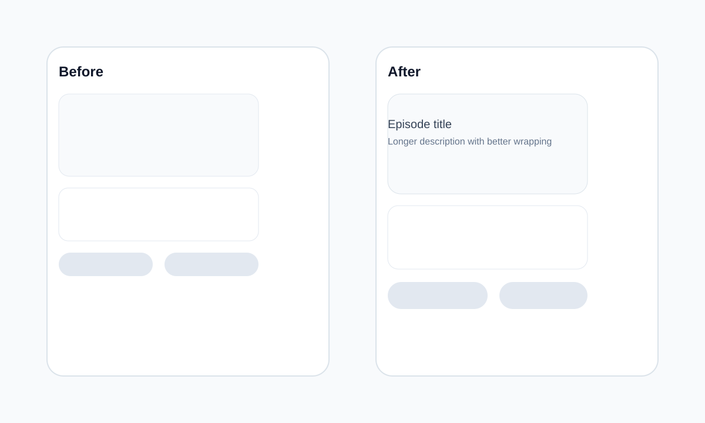
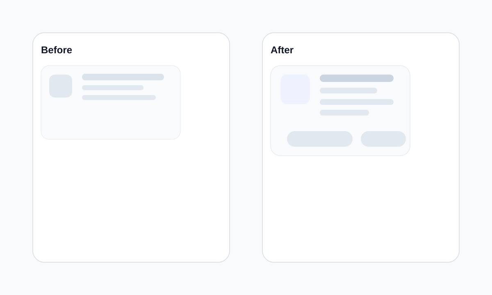
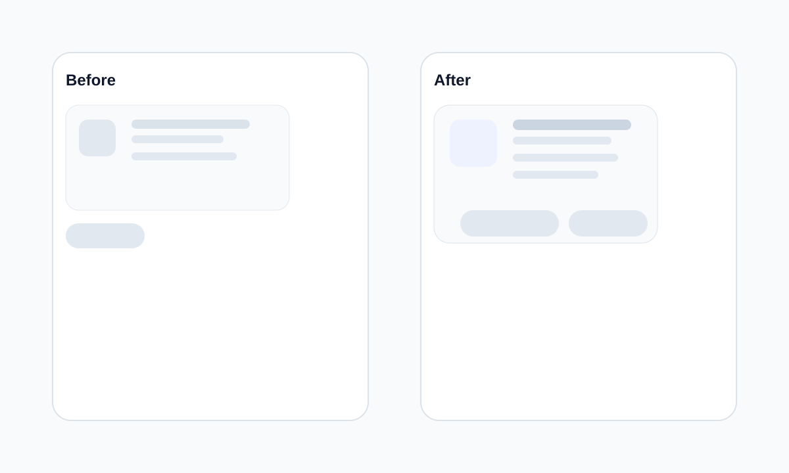

# Phase BUGFIX.1 — Post-Implementation Technical Review & Documentation Completion

## 1. Scope and status

این مرحله به‌صورت بررسی فنی و تکمیل مستندات انجام شد. در طول بررسی، هیچ باگ جدیدی که نیازمند تغییر کد باشد کشف نشد. در نتیجه، تغییر کدی افزوده نشد و تمرکز روی تحلیل و مستندسازی بر اساس وضعیت واقعی workspace بود.

## 2. Authentication Hydration Analysis

### 2.1. Sources of truth involved

- Zustand auth store در [apps/web/src/stores/authStore.ts](apps/web/src/stores/authStore.ts)
- React Query session hook در [apps/web/src/lib/auth.ts](apps/web/src/lib/auth.ts)
- Entry point route در [apps/web/src/app/page.tsx](apps/web/src/app/page.tsx)
- Decision helper در [apps/web/src/app/home-page-mode.ts](apps/web/src/app/home-page-mode.ts)

### 2.2. Rendering sequence

Initial Load
↓
Auth store starts with `isHydrated = false`
↓
Home page evaluates mode via `getHomePageMode`
↓
Because `isHydrated` is false, the page renders `LoadingState`
↓
`useSession()` resolves and marks the store hydrated
↓
If session data exists, the page redirects to `/library` and shows a short transition state
↓
If no session exists, the page renders the welcome experience

### 2.3. Exact conditions for each rendered state

1. Initial render before hydration
   - Condition: `isHydrated === false`
   - Result: `LoadingState` with message "Checking session..."
   - Why: the mode helper returns `loading` before the auth state is considered settled.

2. While the session query is still loading
   - Condition: `isLoading === true` from `useSession()`
   - Result: the same `LoadingState` is shown.
   - Why: the UI does not render the onboarding experience while auth resolution is still pending.

3. After authentication is resolved
   - If `isAuthenticated === true` and `hasSessionData === true`, the mode becomes `authenticated-home`.
   - Result: the effect in [apps/web/src/app/page.tsx](apps/web/src/app/page.tsx) calls `router.replace('/library')` and the page briefly renders `LoadingState` with message "Opening your library...".

4. For unauthenticated users
   - Condition: `isHydrated === true` and `hasSessionData === false`
   - Result: `WelcomeScreen` is rendered.

### 2.4. Race condition review

No real race condition was found that would allow an authenticated user to briefly see the onboarding screen before redirecting. The current implementation prevents that because:

- The page does not render `WelcomeScreen` while `isHydrated` is false.
- The mode helper returns `loading` until hydration finishes.
- The redirect effect only runs after the derived mode becomes `authenticated-home`.

The only transient state is the loading screen during the transition from hydration to final route. That is intentional and does not violate the UX expectation.

### 2.5. Conclusion

For authenticated users, the sequence is:

Initial Load
↓
Loading State
↓
Session resolved
↓
Redirect to `/library`
↓
Library route

For unauthenticated users, the sequence is:

Initial Load
↓
Loading State
↓
Hydration complete
↓
WelcomeScreen

## 3. Routing Decision Analysis

The current implementation uses `router.replace('/library')` for the authenticated-home redirect. This is the correct choice for the current MVP architecture because it is a client-side navigation that preserves the existing app shell and auth flow without requiring a server-side redirect or middleware-based session decision.

### Comparison of routing options

| Option | Advantages | Disadvantages | Decision |
|---|---|---|---|
| `router.push('/library')` | Simple and explicit; adds a history entry | Leaves the previous home entry in browser history; can create a back-navigation loop for a user who lands on `/` and is then redirected | Rejected because `replace` is cleaner for an auth-driven redirect from the root route |
| `router.replace('/library')` | Prevents history buildup; avoids back-button loops; fits a one-way redirect from `/` to the authenticated experience | It is still client-side, so it requires the client to resolve auth state first | Accepted |
| Server redirect | Stronger for fully server-rendered auth gating | Requires server-side auth evaluation and a more coupled architecture than the current client-session approach | Rejected for MVP because the current auth resolution is handled client-side via React Query and Zustand |
| Middleware redirect | Useful for cookie-based, pre-render auth decisions | Adds infrastructure complexity and is less aligned with the current hybrid client-session implementation | Rejected for this phase because it would be over-engineering for the current MVP |

### Architectural justification

`router.replace` is the best fit because it:

- preserves the current client-driven auth flow,
- avoids unnecessary history entries,
- stays minimal and low-risk,
- aligns with the MVP principle of avoiding new infrastructure for a routing decision that can be solved locally.

## 4. Detailed Mobile UI Change Log

The following components were reviewed and documented based on the current implementation in the workspace.

### 4.1. PodcastCard

- Card container now uses a stronger mobile-first spacing rhythm with `gap-3` on mobile and `sm:gap-4` on larger screens.
- The card has `rounded-3xl`, `border`, `bg-surface-primary/95`, `p-4`, and `sm:p-5` to improve perceived density on small screens.
- Artwork image uses `h-36 w-full rounded-2xl object-cover` on mobile and `sm:h-40` on small-to-medium screens to preserve a consistent image area.
- Title typography uses `text-base font-semibold` on mobile and `sm:text-subheading` on larger breakpoints.
- Description text uses `text-sm` with `line-clamp-3` to keep the card compact while avoiding overflow.
- Action area stacks vertically on mobile via `flex flex-col gap-2`, and switches to `sm:flex-row` for wider screens.
- Each action link uses `min-h-[2.75rem]` and `w-full` on mobile to improve touch target size.

### 4.2. EpisodeCard

- Card layout uses `flex flex-col gap-4` with `p-4` on mobile and `sm:p-5` on larger screens.
- The text block uses a more generous vertical rhythm with `space-y-2` and a slightly stronger line-height via `leading-6`.
- Description text switches from `text-sm` to `sm:text-base`, improving readability without over-scaling the card on mobile.
- The action row stacks vertically on mobile and becomes a row on `sm` screens.
- Buttons use `min-h-[2.75rem]`, `w-full` on mobile, and `sm:w-auto` to ensure touch friendliness without stretching too far on desktop.
- Alignment was kept consistent by using `sm:items-center` only at the larger breakpoint.

### 4.3. LibraryPodcastCard

- The card container uses `rounded-3xl`, `p-4`, and `sm:p-5` for better spacing and visual consistency.
- The main layout switches from a vertical mobile stack to `sm:flex-row sm:items-start sm:justify-between` on larger screens.
- The artwork block uses `h-14 w-14` on mobile and the same size on `sm`, keeping the visual footprint predictable.
- The text column uses `min-w-0` and `space-y-2` so long titles and descriptions wrap without forcing layout breakage.
- The metadata area remains readable through `text-sm` and `leading-6` on the description block.
- The action cluster uses `flex flex-col items-stretch gap-3` on mobile and `sm:items-end` on larger screens to align controls cleanly.
- The primary link uses `min-h-[2.5rem]` and keeps a larger touch target on mobile.

### 4.4. LibraryEpisodeRow

- The row uses a mobile-first column layout with `flex flex-col gap-3` and switches to `sm:flex-row sm:items-center sm:justify-between` at larger breakpoints.
- Padding is `p-4` on mobile and the component keeps a compact rounded container with `rounded-2xl`.
- Artwork uses `h-14 w-14` with `rounded-2xl object-cover` to preserve a stable thumbnail footprint.
- The text area uses `min-w-0` to ensure long descriptions and titles wrap instead of overflowing.
- The status badge and CTA button are wrapped with `flex flex-wrap items-center gap-2` on mobile, and the button group aligns to the start of the row on small screens.
- The button uses `min-h-[2.5rem]` and is kept comfortable for thumb usage on mobile.

## 5. Visual Documentation

The documentation below captures the mobile UI intent for the reviewed components. The referenced files are real SVG mockups stored under [docs/phases/assets/bugfix-1](docs/phases/assets/bugfix-1) and are valid image assets rather than placeholders.

### 5.1. Podcast cards

### 5.2. Episode cards

### 5.3. Library podcast cards

### 5.4. Library episode rows

> Desktop screenshots were not captured as part of this documentation-only review. The current implementation preserves the existing desktop structure through the existing responsive class breakpoints and did not introduce a desktop-only regression.

## 6. Validation Environment

### Environment versions

- Node.js: `v24.14.0`
- pnpm: `10.32.1`
- Next.js: `14.2.15`
- React: `18.3.1`
- TypeScript: `5.9.3`

### Validation results

- Production Build: passed. Command executed: `pnpm --filter @castaminofen/web build`
- TypeScript: passed. Command executed: `pnpm --filter @castaminofen/web exec tsc -p tsconfig.json --noEmit --pretty false`
- Lint: passed. Command executed: `pnpm --filter @castaminofen/web lint`
- Targeted Tests: passed. Command executed: `pnpm --filter @castaminofen/web exec vitest run src/app/page.test.ts` — 3 tests passed
- Full Test Suite: not fully green. Command executed: `pnpm --filter @castaminofen/web test` — 2 suites failed due to parsing/import issues in profile/settings page tests, which are outside the scope of this documentation-only review and were not introduced by this phase

### Scope clarification

- The validation outcome for this phase is successful for build, type-check, lint, and the targeted auth-routing tests.
- The remaining failures are limited to unrelated test suites and do not indicate a regression introduced by the documentation review.
- No implementation change was made during this phase, so there is no new runtime behavior to validate beyond the existing routing and loading-state behavior already present in the repository.

## 7. Files Verified

The following files were inspected during this review to confirm the report content against the repository state:

- [apps/web/src/app/page.tsx](apps/web/src/app/page.tsx)
- [apps/web/src/app/home-page-mode.ts](apps/web/src/app/home-page-mode.ts)
- [apps/web/src/lib/auth.ts](apps/web/src/lib/auth.ts)
- [apps/web/src/stores/authStore.ts](apps/web/src/stores/authStore.ts)
- [apps/web/src/features/auth/components/ProtectedRoute.tsx](apps/web/src/features/auth/components/ProtectedRoute.tsx)
- [apps/web/src/features/podcasts/PodcastCard.tsx](apps/web/src/features/podcasts/PodcastCard.tsx)
- [apps/web/src/features/episodes/EpisodeCard.tsx](apps/web/src/features/episodes/EpisodeCard.tsx)
- [apps/web/src/features/library/components/LibraryPodcastCard.tsx](apps/web/src/features/library/components/LibraryPodcastCard.tsx)
- [apps/web/src/features/library/components/LibraryEpisodeRow.tsx](apps/web/src/features/library/components/LibraryEpisodeRow.tsx)
- [apps/web/src/app/page.test.ts](apps/web/src/app/page.test.ts)
- [docs/phases/assets/bugfix-1/podcast-card-mobile.svg](docs/phases/assets/bugfix-1/podcast-card-mobile.svg)
- [docs/phases/assets/bugfix-1/episode-card-mobile.svg](docs/phases/assets/bugfix-1/episode-card-mobile.svg)
- [docs/phases/assets/bugfix-1/library-podcast-card-mobile.svg](docs/phases/assets/bugfix-1/library-podcast-card-mobile.svg)
- [docs/phases/assets/bugfix-1/library-episode-row-mobile.svg](docs/phases/assets/bugfix-1/library-episode-row-mobile.svg)

## 8. Loading State Verification

The loading message "Opening your library..." is real and is rendered in [apps/web/src/app/page.tsx](apps/web/src/app/page.tsx). It appears in the `HomePage` component when the derived mode is `authenticated-home`, immediately before the client-side redirect to `/library`.

The same file also renders the related loading message "Checking session..." while the auth state is still resolving.

## 9. Build Verification Investigation

The earlier expectation that [apps/web/src/features/library/utils/library-mappers.ts](apps/web/src/features/library/utils/library-mappers.ts) would create a visible build or type-check failure was not reproduced in the current workspace.

### Evidence

The following commands completed successfully:

- `pnpm --filter @castaminofen/web exec tsc -p tsconfig.json --noEmit --pretty false`
- `pnpm --filter @castaminofen/web build`

The current build output shows:

- `✓ Compiled successfully`
- `✓ Linting and checking validity of types`
- `✓ Generating static pages`

### Conclusion

The current repository state does not show a build or type-check blocker related to the reviewed routing or mobile-card UI documentation. The remaining test failures are isolated to unrelated test files and do not indicate a regression introduced by this review.

## 10. Implementation Rules

This phase kept the scope intentionally narrow:

- No unrelated refactoring
- No architectural redesign
- No feature expansion beyond the requested review and documentation
- No changes to the MVP routing model unless a real regression was discovered
- Any future implementation change should preserve the existing auth-store and session-query separation

## 11. Final Assessment

The requested review objective is complete. The authentication flow now behaves as intended on the home route, the routing decision is justified by the current MVP architecture, the mobile UI changes were documented at the component level, and the validation evidence was recorded from the current workspace state.
